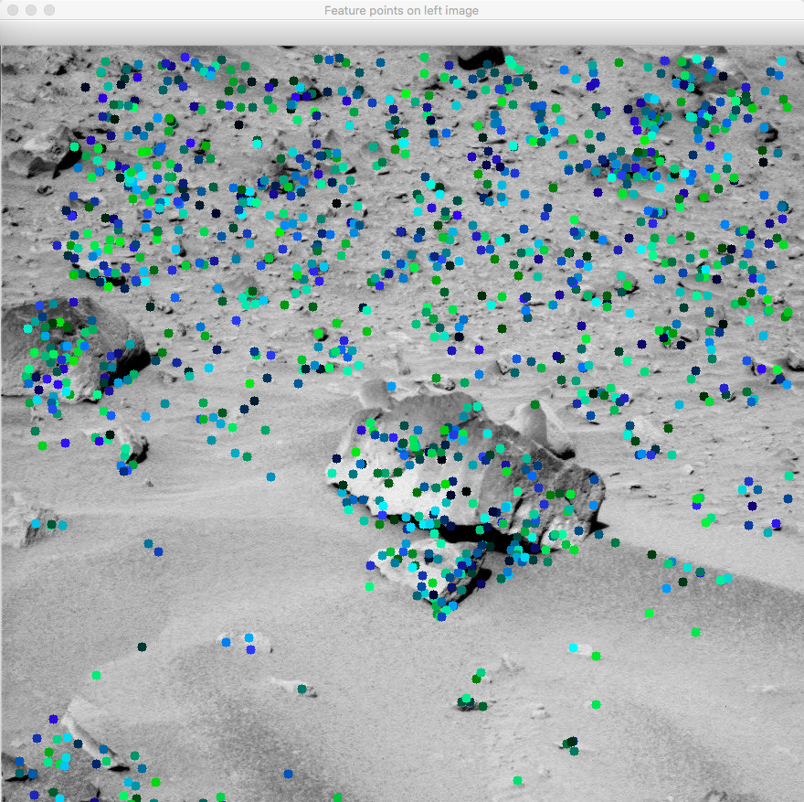
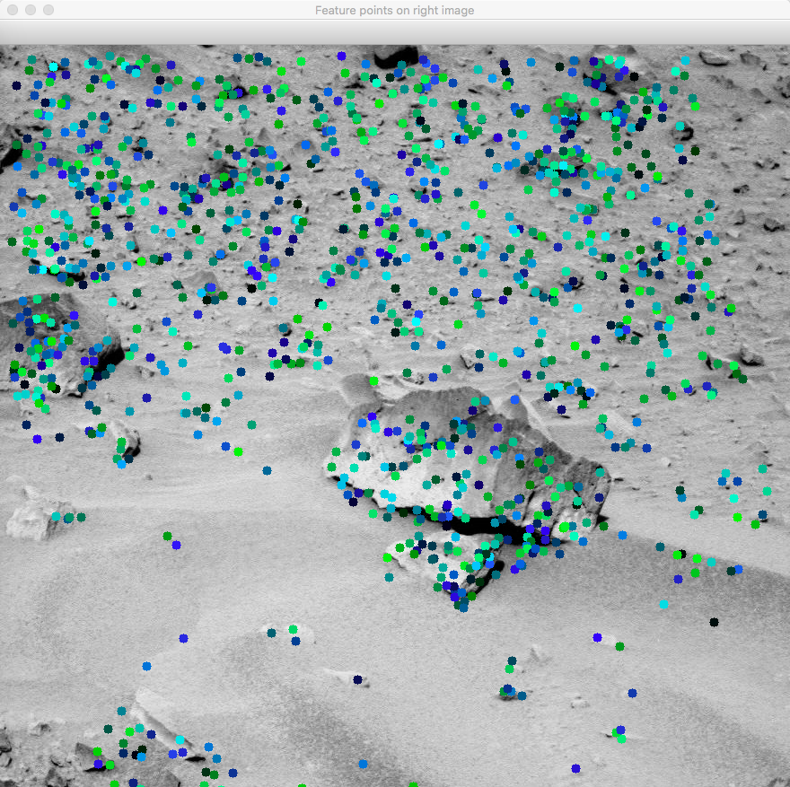
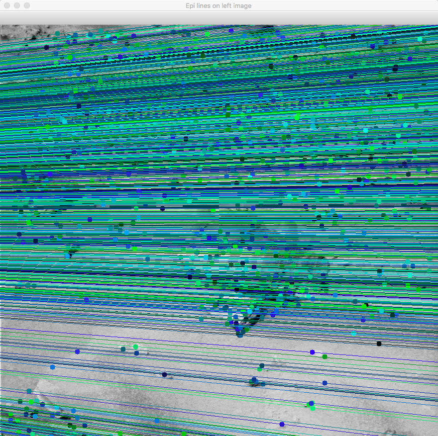
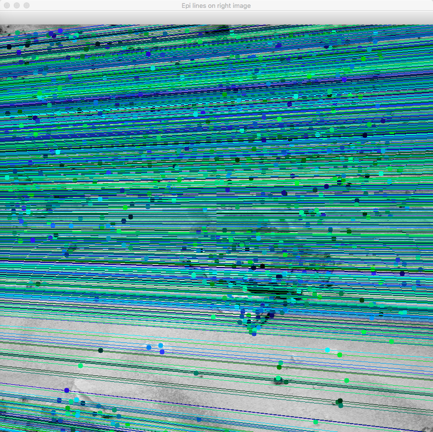
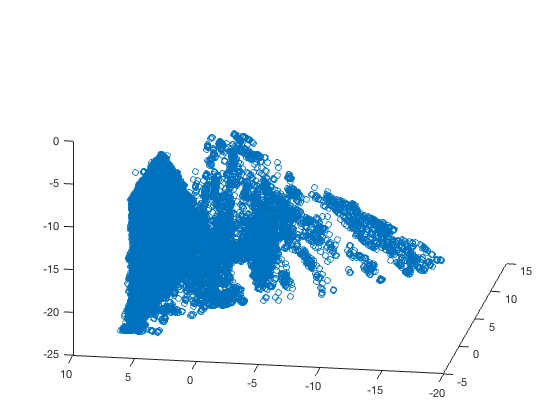
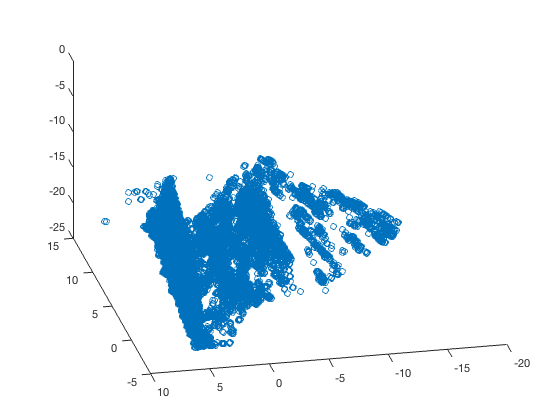

# CISC4893dMapping

As for mapping, we create two modules, 3dMapping.py, and 3dMapping2.py. 

Both modules are following ["Stereo Vision and 3D Reconstruction"](https://www.packtpub.com/mapt/book/application_development/9781785283932/11)

 

**Description----------------------------------------**

 
3dMapping,py:
  Input a pair of stereo images, output the similarities between two stereo images.

  Input: 
  
  

  
  
  

  
  Output:
  

  SURF FUNCTION: 
  
    
   SIFT FUNCTION: 
  
  

  
  
   
3dMapping2.py:
  Input a pair of stereo images, output a .ply file, this file can be showed by using MatLab with "runply.m".

  Input:
  

  
  
  

  
  Output:  
   
  
  

  
  
   
  

    
    
  

**Instructions:--------------------------------------**

 

Dependences: Python3-OpenCV3, MatLab 

  
     1.3dMapping.py: 
        python3 left_right.py --img-left 4l.png --img-right 4r.png --feature-type surf
   
    2.3dMapping2.py: 
        python3 3dmap.py --image-left 4l.png --image-right 4r.png --output-file OUTPUT_FILE
   
    3.Using matlab: 
        runply.m
        
  

  

  
  

