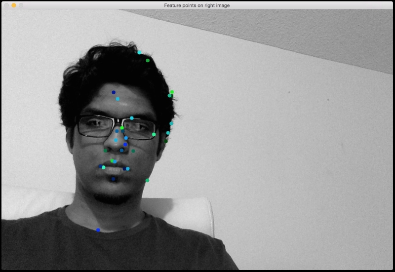

# CISC4893dMapping

As for mapping, we create two modules, 3dMapping.py, and 3dMapping2.py. 

Both modules are following ["Stereo Vision and 3D Reconstruction"](https://www.packtpub.com/mapt/book/application_development/9781785283932/11)

 
**Description----------------------------------------**
 
3dMapping,py:
  Input a pair of stereo images, output the similarities between two stereo images.

  Input: 
  
  

  
  
  

  
  Output:
  

  
  

  
  
   
3dMapping2.py:
  Input a pair of stereo images, output a .ply file, this file can be showed by using MatLab.

  Input:
  
  

  
  
  

  
  Output:  
   
  
  
<(>

    
    
  

**Instructions:--------------------------------------**

 

Dependences: OpenCV, MatLab 

  

For 3dMapping.py: 
   3dMapping.py 4l.png 4r.png sift|surf

  

For 3dMapping2.py: 
   3dMapping2.py 4l.png 4r.png output

